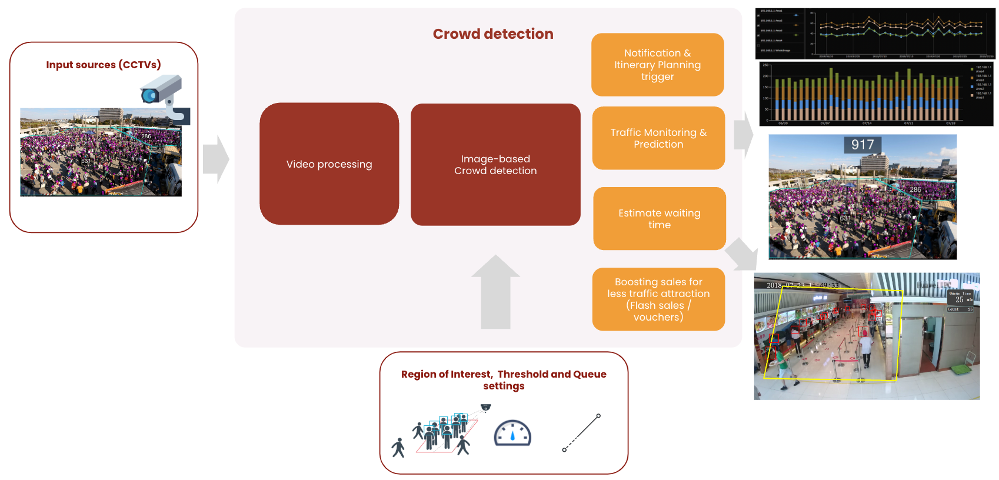

# Crowd monitoring for outdoors

# Overview
An efficent video-based crowd monitoring solution for places such as theme park, airports, etc. This includes counting, tracking crowd levels, estimating waiting time in queue, etc. The applications are wide-ranging, one can use this solution to synchronize with iterary plan in theme parks, or to optimize scheduling in airports, subways, etc. Our approach is light-weight, and can run on CPU with real-time processing ability.

We take advatange of YOLOv5 for object detection and optical flow for monitoring. However, occlusion and other obstacles can downgrade the accuracy. To overcome this, we approximate using conventional image processing methods. Below is the main components of the solution

Before running, we need to setup
* Crowd detection ROI
* Define crowd levels and corresponding thresholds
* Queue ROI

<!-- TODO: # How to run -->

# Showcase

Setting

Processing

